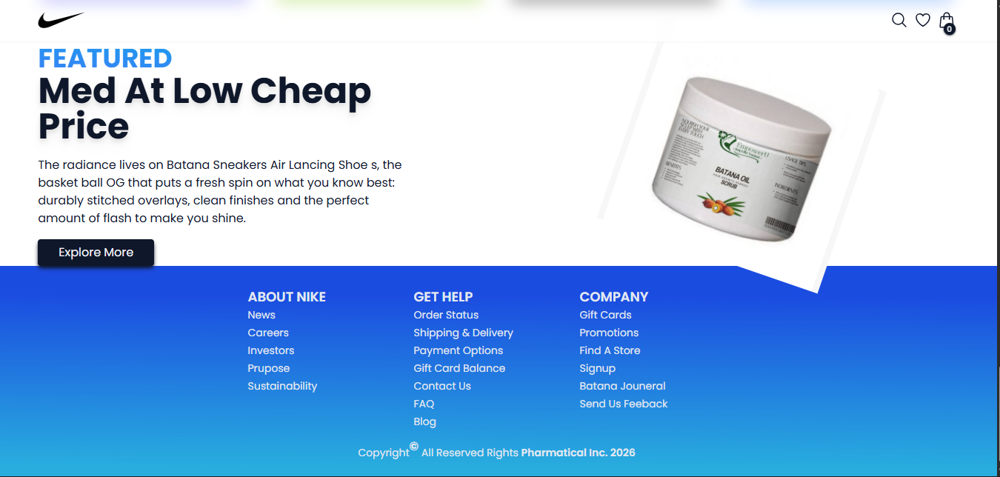
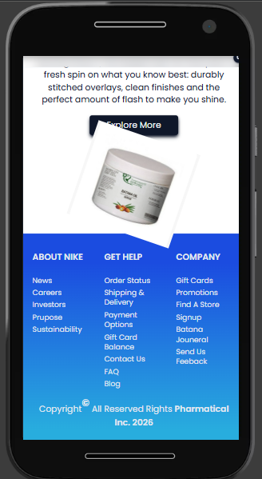
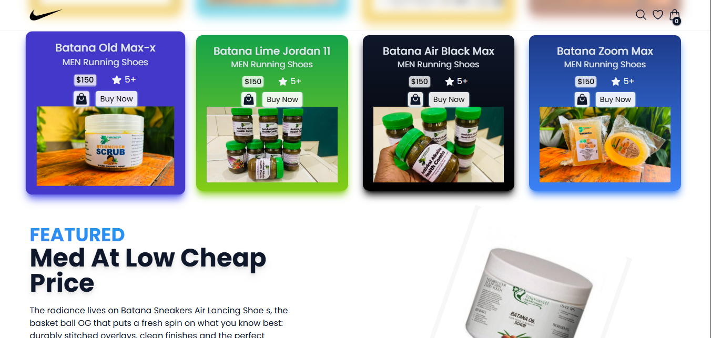
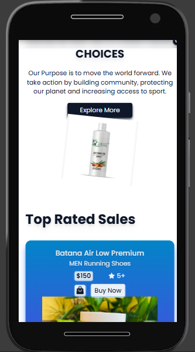
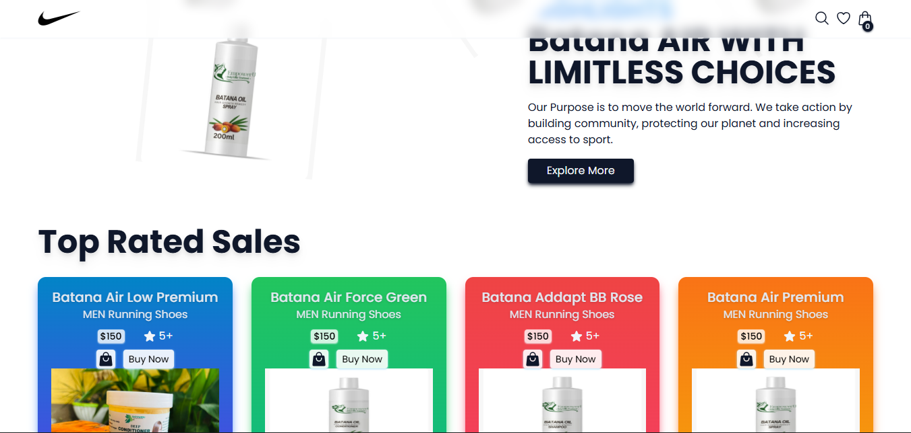

# Nike Store Commerce Web Application! Check Live: [https://pharmaticaul.vercel.app//](https://pharmaticaul.vercel.app/)
## 📸 Project Preview

### 🏠 HomePage1


### 🔐 HomePage1 Mobile


### 🏠 HomePage2


### 🏠 HomePage2 Mobile


### 🏠 HomePage3


---

This is a [Vite.js](https://vitejs.dev/) project bootstrapped with [`npm create vite@latest`]. Designed with TailwindCSS!
# Important Links: 📣📢📣📢📣📢✈✈✈
### Go to ViteJS [https://vitejs.dev/] (https://vitejs.dev/)!
### Go to TailwindCSS [https://tailwindcss.com/](https://tailwindcss.com/)!
### Go to Redux-Toolkit [https://redux-toolkit.js.org/](https://redux-toolkit.js.org/)!
### Go to React-Redux [https://react-redux.js.org/](https://react-redux.js.org/)!
### Go to React-Hot-Toast [https://react-redux.js.org/](https://react-redux.js.org/)!

## Getting Started

First, run the development server:

```bash
npm install
# or
yarn instll

# and Now:

npm run dev
# or
yarn dev
```
Open [http://localhost:5173/](http://localhost:5173/) with your browser to see the result.

You can start editing the page by modifying `src/App.jsx`. The page auto-updates as you edit the file.

## Deploy on Vercel
Check out our [This Project On Vercel](https://travigo-travel-jsstack.vercel.app) for more details.
